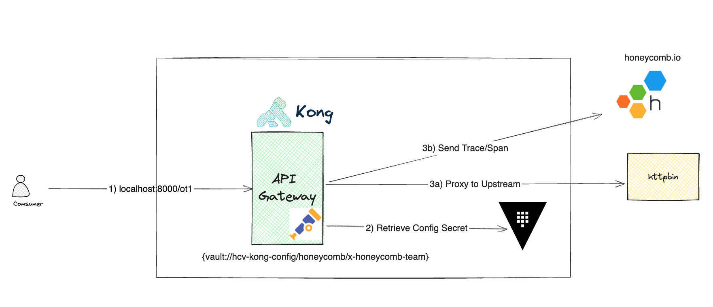
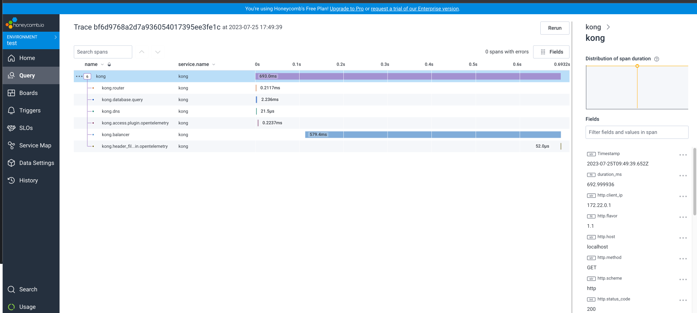

# Kong Secret Management with Hashicorp Vault


This will demonstrate how we stored Honeycomb API Key securely in Hashicorp Vault when configuring our OpenTelemetry Plugin. With this feature, you can securely rotate your secrets at your own secrets management solutions



## Setting Up

Create your own .env file and provide the required values. They are required to run the containers.

```
VAULT_DEV_ROOT_TOKEN_ID=
POSTGRES_PASSWORD=
```

### Enterprise License Loading (Optional)

For Kong enterprise users, you can load the license by sending a request Kong Admin API

```
http POST :8001/licenses \
  payload='LICENSE_KEY'
```

## Starting Up

The docker compose will spin up Kong Gateway, Postgres and Hashicorp Vault

1. Start Docker Compose 
```
docker-compose up -d
```

2. Tear-down
```
docker-compose down
```


## Configuration 

### Create Vault Entity

```
curl -i -X PUT http://localhost:8001/vaults/hcv-kong-config \
  --data name="hcv" \
  --data description="Storing secrets in HashiCorp Vault" \
  --data config.protocol="http" \
  --data config.host="vault" \
  --data config.port="8200" \
  --data config.mount="<mount>" \
  --data config.kv="v2" \
  --data config.token="<mytoken>"
```

More configuration for Kong x HCV can be found here: https://docs.konghq.com/gateway/3.3.x/kong-enterprise/secrets-management/backends/hashicorp-vault/

### Put Secret in HCV

```
http --quiet $VAULT_URL/v1/<mount>/data/honeycomb 'data:={"key":"value"}' X-Vault-Token:<mytoken>
```

### Create Demo Service and Route

```
http :8001/services url=https://mockbin.org/request name=ot-demo

http :8001/services/ot-demo/routes name=ot-route expression='(http.path ^= "/ot2" || http.path ^= "/ot1")'
```


### Apply Opentelemetry Plugin with Secret reference

```
deck sync  --kong-addr=http://localhost:8001 -s config/otel.yaml
```

### Testing

```
http POST :8000/ot1 "X-Foo:hello OT1"
http GET :8000/ot2 "X-Foo:hello OT2"
```

You should see the trace coming in your Honeycomb dashboard




## References

1. [Kong with Hashicorp Vault as Secret Backend](https://docs.konghq.com/gateway/latest/kong-enterprise/secrets-management/backends/hashicorp-vault/)
